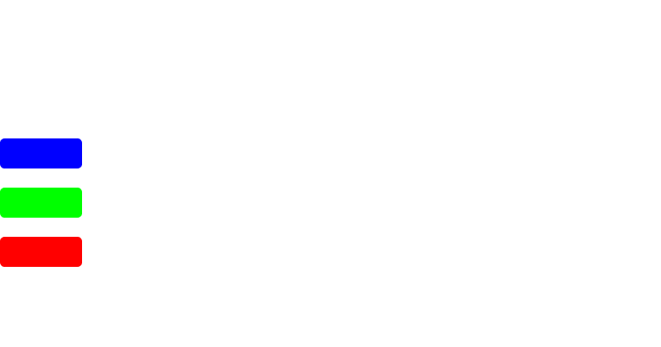

[![Contributors][contributors-shield]][contributors-url]
[![Forks][forks-shield]][forks-url]
[![Stargazers][stars-shield]][stars-url]
[![Issues][issues-shield]][issues-url]
[![MIT License][license-shield]][license-url]
[![LinkedIn][linkedin-shield]][linkedin-url]

<!-- PROJECT LOGO -->
 

  

   
  

    Integrated circit discrptive language and Emulator
     
    <a href="https://github.com/mahanfr/Idle/issues">Report Bug</a>
    ·
    <a href="https://mahanfr.github.io/Idle/">Documentaion</a>
  

## About The Project

Idle is a Discriptive language and an emulator for desgin and testing logical or analog integrated circits.

## Contributing
Contributions are what make the open source community such an amazing place to learn, inspire, and create. Any contributions you make are **greatly appreciated**.

If you have a suggestion that would make this better, please fork the repo and create a pull request. You can also simply open an issue with the tag "enhancement".
Don't forget to give the project a star! Thanks again!

1. Fork the Project
2. Create your Feature Branch (`git checkout -b feature/AmazingFeature`)
3. Commit your Changes (`git commit -m 'Add some AmazingFeature'`)
4. Push to the Branch (`git push origin feature/AmazingFeature`)
5. Open a Pull Request

## License

Distributed under the MIT License. See `LICENSE.txt` for more information.

[contributors-shield]: https://img.shields.io/github/contributors/mahanfr/Idle.svg?style=for-the-badge
[contributors-url]: https://github.com/mahanfr/Idle/graphs/contributors
[forks-shield]: https://img.shields.io/github/forks/mahanfr/Idle.svg?style=for-the-badge
[forks-url]: https://github.com/mahanfr/Idle/network/members
[stars-shield]: https://img.shields.io/github/stars/mahanfr/Idle.svg?style=for-the-badge
[stars-url]: https://github.com/mahanfr/Idle/stargazers
[issues-shield]: https://img.shields.io/github/issues/mahanfr/Idle.svg?style=for-the-badge
[issues-url]: https://github.com/mahanfr/Idle/issues
[license-shield]: https://img.shields.io/github/license/mahanfr/Idle.svg?style=for-the-badge
[license-url]: https://github.com/mahanfr/Idle/blob/master/LICENSE.txt
[linkedin-shield]: https://img.shields.io/badge/-LinkedIn-black.svg?style=for-the-badge&logo=linkedin&colorB=555
[linkedin-url]: https://linkedin.com/in/mahanfarzaneh
[product-screenshot]: assets/nemet.png
